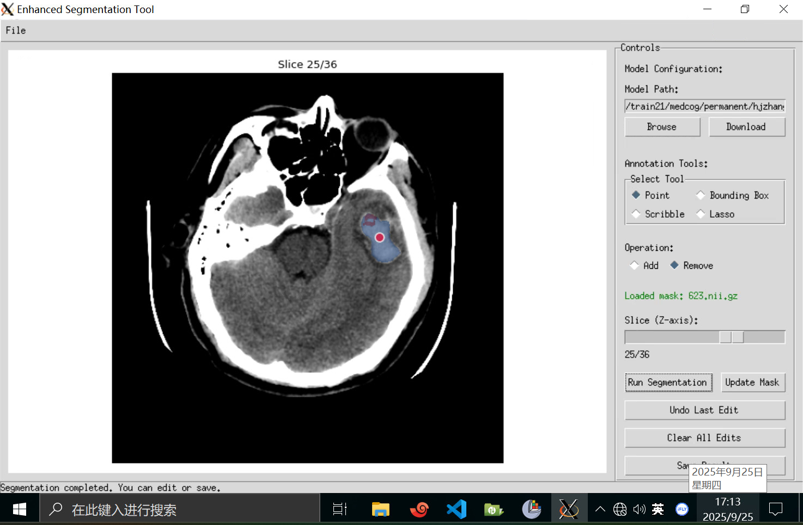
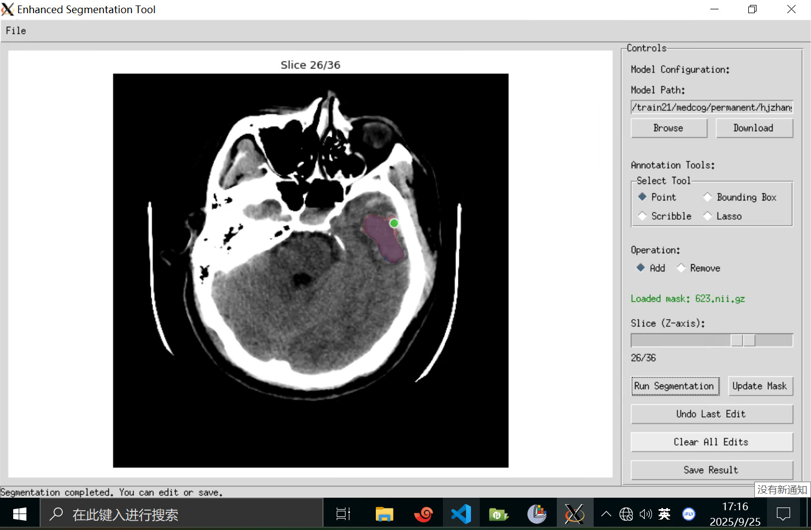

# 调试机运行与标注操作指南
本文档详细说明调试机环境激活、X11 安装配置、项目启动及 UI 界面使用的完整流程，步骤清晰可落地，适用于医学图像标注场景的日常操作。


## 一、环境激活
首先通过终端激活项目依赖的 Conda 环境，执行以下命令（路径固定，直接复制运行即可）：
```bash
conda activate /train21/medcog/permanent/hjzhang43/miniconda/envs/nnInteractive
```


## 二、X11 安装与配置（图形化交互关键步骤）
X11 用于支持 UI 界面的图形化显示，需在 **Windows 云桌面** 完成以下配置：
1. **下载 X11 安装包**  
   从调试机指定路径，将安装包复制到本地云桌面：  
   源路径：`/train21/medcog/permanent/hjzhang43/Downloads/Xming-6-9-0-31-setup.exe`
2. **安装 X11**  
   双击运行 `Xming-6-9-0-31-setup.exe`，按安装向导默认步骤完成（推荐保留默认安装路径：`C:\Program Files (x86)\Xming\`）。
3. **配置调试机 IP 地址**  
   - 启动 Xming 配套工具 `Xlaunch`（安装后可在 Windows 开始菜单搜索找到）。  
   - 找到 X11 配置文件 `X0.hosts`，路径为：`C:\Program Files (x86)\Xming\X0.hosts`。  
   - 若提示“权限不足”：先将 `X0.hosts` 复制到桌面，用记事本打开，添加调试机 IP 地址（示例：`172.19.12.11`），保存后替换回原路径。
4. **配置验证**  
   完成上述操作后，在 Xshell 执行后续启动命令时，将自动唤起 X11 图形交互窗口，无需额外操作。


## 三、项目启动
1. **进入项目目录**  
   打开 Xshell 连接调试机后，切换到项目根目录（若默认 `cd` 命令进入用户主目录，需补充实际项目路径，示例如下）：
   ```bash
   # 若项目在指定路径，替换为实际路径（示例：cd /train21/medcog/project）
   cd 
   ```
2. **启动 UI 界面**  
   执行命令启动交互界面，首次运行需等待依赖加载（约 5-15 秒，具体视环境而定）：
   ```bash
   python ui_test.py
   ```
   - **显示异常处理**：界面启动后若出现布局错位，可通过「调试机窗口全屏/小窗口切换」调整，直至显示正常。  
   - 启动成功示例：  
     


## 四、UI 界面使用说明
### 4.1 模型与数据加载（前置必做步骤）
标注前需完成 **模型加载** 和 **医学图像导入**，顺序无强制要求，但需确保两者均加载完成：
1. **加载模型**  
   - 在 UI 界面找到“模型路径”选择区域（参考界面内文字提示），选中目标模型的存放路径。  
   - 点击“加载”按钮（按钮名称以实际界面为准），等待模型初始化完成（下面那行小字会提示“模型加载成功”）。  
   - 模型路径
     
2. **导入医学图像**  
   - 点击界面右上角 `File` 菜单，选择 `Open Image` 选项。  
   - 在文件选择窗口中，选中并导入 **.nii.gz 格式** 的医学图像（仅支持该格式，其他格式无法识别）。  
     


### 4.2 标注操作（两种核心模式）
#### 模式1：无预标注 Mask（原始标注）
适用于无预设掩码的图像标注，操作流程简洁，步骤如下：
1. **选择标注工具**  
   界面提供 4 种工具，其中 `Bounding Box` 存在已知功能问题，推荐优先使用其余三种：
   - **Point（点标注）**：单击鼠标添加标注点，可在 `Operation` 选项中切换“正点”“负点”。  
   - **Bounding Box（框标注，暂不推荐）**：按住鼠标左键拖动，释放后生成矩形标注框。  
   - **Scrible（涂鸦标注）**：按住鼠标左键连续拖动，形成任意形状的闭合区域（首尾靠近时自动闭合）。  
   - **Lasso（套索标注）**：单击鼠标左键添加至少 3 个顶点，点击鼠标右键后，系统自动连接顶点形成闭合区域。
2. **执行分割与标注编辑**  
   - 标注完成后，点击 `Run Segmentation` 按钮，系统基于标注内容进行分割计算。  
   - 标注修改：点击 `Undo Last Edit` 撤销上一步操作；点击 `Clear All Edits` 清除当前所有标注，重新开始。  
     

#### 模式2：基于预标注 Mask（微调标注）
适用于已有预标注掩码的场景，核心是在原始 Mask 基础上进行“删除”“新增”微调，步骤如下：
1. **加载预标注 Mask（关键前提）**  
   - 需先完成「4.1 模型与数据加载」中的“医学图像导入”（即先加载原始 .nii 图像）。  
   - 点击 UI 界面左上角 `Load Initial Mask` 按钮（按钮位置及名称以实际界面为准），在文件窗口中选中预标注 Mask 文件并加载。  
     
2. **标注颜色含义（快速识别状态）**  
   - 加载成功后，界面显示的 **紫色区域** 为原始预标注 Mask（即初始标注内容）。  
     
3. ** Mask 微调操作**  
   - **删除原始标注**：使用「模式1」中的 `Point` 工具，选择 `Operation` 中的“负点”，在需删除的紫色区域单击添加蓝色负点，该区域会从新 Mask 中消除（蓝色仅为操作标记，最终不保留）。  
     
   - **新增标注内容**：使用「模式1」中的任意推荐工具（如 Scrible、Lasso），在需新增标注的区域操作，新增部分会显示为 **红色**（红色为新增标记，最终会融入 Mask）。  
     
4. **保存微调结果（必做步骤）**  
   - 微调完成后，需点击界面中的 `Update Mask` 按钮（按钮名称以实际界面为准），更新当前 Mask 内容。  
   - 若未点击 `Update Mask` 直接保存，微调内容不会被记录；点击更新后，再执行“保存”操作（参考界面内保存按钮），即可保留最终微调后的 Mask。